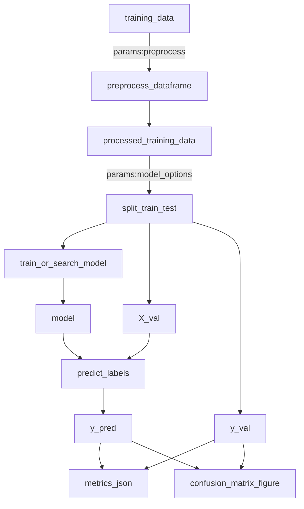

# Pipeline overview

The project is composed of three logical stages, each implemented as Kedro pipelines/nodes:

1. **Preprocessing** (module: `mlstream.pipelines.data_processing`)
   - Node: `preprocess_dataframe` → outputs `processed_training_data`.

2. **Modeling** (module: your data-science pipeline)
   - Node: `split_train_test` → outputs `X_train`, `X_val`, `y_train`, `y_val`.
   - Node: `train_or_search_model` → outputs `model`, `training_results`.

3. **Evaluation & Reporting** (module: evaluation utilities + pipeline)
   - Node: `predict_labels` → outputs `y_pred`.
   - Node: `metrics_json` → outputs `training_metrics_json`.
   - Node: `confusion_matrix_figure` → outputs `confusion_matrix_fig`.

## Execution flow

All data inputs/outputs are governed by the **Kedro Data Catalog**; configuration lives in `conf/*/catalog.yml` and `conf/*/parameters.yml` (see [Config](config/parameters.md) for details).

## What you’ll get after a run

- Trained model pickle: `data/05_training/model.pkl` (versioned)
- Training results JSON: `data/05_training/training_results.json` (versioned)
- Predictions CSV: `data/06_model_output/y_pred.csv`
- Metrics JSON: `data/07_reporting/training_metrics.json`
- Confusion matrix PNG: `data/07_reporting/confusion_matrix.png`